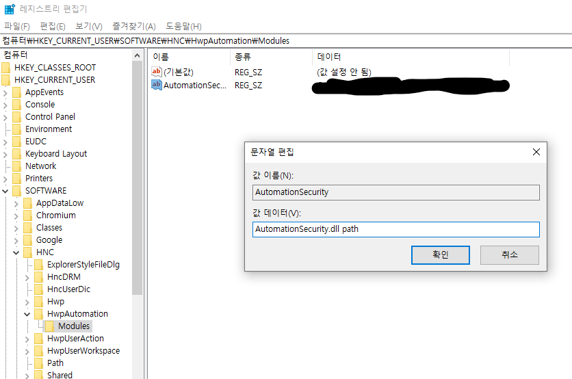

Requirements
====
You need 한/글(proprietary SW) to use this program. 
Because this program is just an ActiveX which runs 한/글
> 한/글 2014 VP, 한/글 NEO, 한/글 2018, 한/글 2020 ~

Though you have adequate version but error occurs, check .hwpx patches here

https://www.hancom.com/cs_center/csDownload.do?gnb0=25&gnb1=80

How to Use
====
0. Create directory hwp and hwpx in project root
1. Create virtual environment and install packages
2. Update Registry (explained below)
3. Execute main.py

You can download hwp_to_hwpx.exe
----

How to Update Registry
---
Since winreg.SetValueEx does not update registry, user should manually set registry like below

